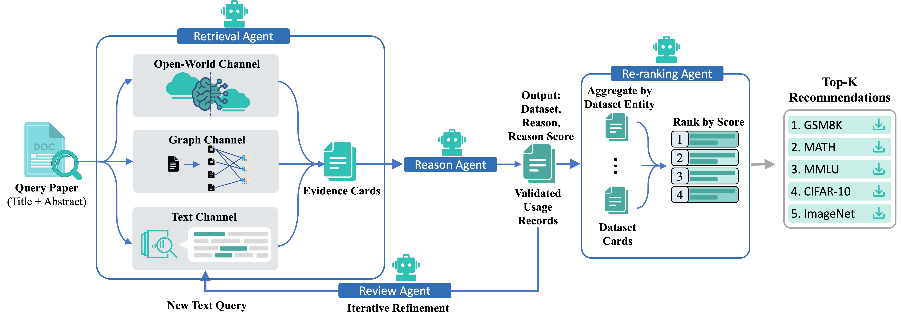

# DatasetSAGE (LLM-Agent Open-Source Implementation)

This repository contains a concise, reviewer-friendly implementation of:
**DatasetSAGE: A Structure-aware Multi-Agent Framework for Scientific Dataset Discovery with Grounded Evidence**.

This version is a agent pipeline and keeps the paper's key mechanisms while remaining readable.



## What This Implementation Preserves

- **Usage-record evidence cards** as the retrieval and reasoning unit.
- **Four agents**:
  - Retrieval Agent
  - Reason Agent
  - Review Agent
  - Re-ranking Agent
- **Three retrieval channels**:
  - Dense RAG retrieval over evidence-card embeddings
  - Structure-aware graph-contrastive retrieval from paper-dataset usage graph
  - Open-world LLM generation channel
- **Two execution modes**:
  - Open-loop: Retrieval -> Reason -> Re-ranking
  - Closed-loop: Retrieval -> Reason -> Review -> Retrieval ... -> Re-ranking

## Repository Layout

- `datasetsage/models.py`: core data contracts.
- `datasetsage/retrieval.py`: multi-channel retrieval logic.
- `datasetsage/agents.py`: LLM-driven reason/review/re-rank agents.
- `datasetsage/prompts.py`: paper-appendix prompt templates.
- `datasetsage/llm.py`: OpenAI-compatible client wrapper.
- `datasetsage/pipeline.py`: open-loop and closed-loop orchestration.
- `scripts/run_demo.py`: runnable demo entrypoint.
- `data/examples/recommendation_samples_20.json`: 20-paper sampled result showcase with ground truth and final recommendations.

## Quickstart

Run from repository root:

```bash
export OPENAI_API_KEY="your_key"
python scripts/run_demo.py \
  --records /path/to/usage_records.json \
  --query /path/to/query_paper.json
```

Optional arguments:

```bash
python scripts/run_demo.py \
  --rounds 2 \
  --top-k 5 \
  --chat-model gpt-4o-mini \
  --embedding-model text-embedding-3-small \
  --output demo_result.json
```

## Input Formats

`usage_records.json` (list of usage edges):

```json
{
  "record_id": "rec_001",
  "source_paper_id": "p_001",
  "source_title": "Paper title",
  "dataset_entity": "coco",
  "dataset_name": "COCO",
  "task": "image captioning",
  "modality": "image",
  "evidence": "Paper usage evidence sentence"
}
```

`query_paper.json`:

```json
{
  "paper_id": "q_001",
  "title": "Your query paper title",
  "abstract": "Your query paper abstract",
  "task_goal": "Optional explicit goal"
}
```

## Real Agent Mechanics

- **RAG (Dense):** embeds query/evidence-card texts and retrieves by cosine similarity.
- **Structure-aware retrieval (Graph):** uses LightGCN-style graph propagation to build dataset structural embeddings, then trains a query projection with InfoNCE-style contrastive learning and retrieves top-$L$ structural matches.
- **Open-world channel:** uses LLM JSON output to propose extra candidates and maps them to canonical dataset entities.
- **Reason/Review/Re-ranking:** all three are LLM calls that return structured JSON decisions.
- **Closed-loop behavior:** round 0 uses Dense + Graph + Open-World; round 1+ re-invokes only Dense with review-refined query (paper-aligned).

## Paper-Aligned Defaults

- Dense Top-$K$: 50
- Graph Top-$K$: 30
- Open-World Top-$K$: 20
- Reason threshold: 0.2
- Closed-loop rounds: 2
- Final output Top-$K$: 30
- Embedding model: `text-embedding-3-small`
- LLM model: `qwen-plus`
- LLM temperature: 0.3

## Notes

In the future, we also consider packaging this into **skills** and releasing it to the agent community.

- Requires valid OpenAI-compatible API credentials.
- This implementation is designed for reproducibility and readability in peer review while preserving real agent behavior.
- This is the current open-source implementation for the paper; we plan to release a more complete production-grade system in the future.
